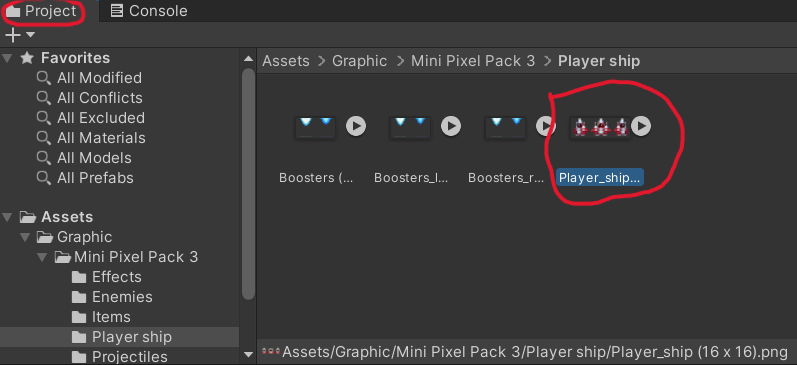

---
# You can also start simply with 'default'
theme: seriph
# random image from a curated Unsplash collection by Anthony
# like them? see https://unsplash.com/collections/94734566/slidev
background: https://cover.sli.dev
# some information about your slides (markdown enabled)
title: Welcome to Slidev
info: |
  ## Slidev Starter Template
  Presentation slides for developers.

  Learn more at [Sli.dev](https://sli.dev)
# apply unocss classes to the current slide
class: text-center
# https://sli.dev/features/drawing
drawings:
  persist: false
# slide transition: https://sli.dev/guide/animations.html#slide-transitions
transition: slide-left
# enable MDC Syntax: https://sli.dev/features/mdc
mdc: true
---

# Unity でシューティングゲームを作ろう

Coder Dojo

<div class="pt-12">
  <span @click="$slidev.nav.next" class="px-2 py-1 rounded cursor-pointer" hover="bg-white bg-opacity-10">
    次へ <carbon:arrow-right class="inline"/>
  </span>
</div>

<div class="abs-br m-6 flex gap-2">
  <button @click="$slidev.nav.openInEditor()" title="Open in Editor" class="text-xl slidev-icon-btn opacity-50 !border-none !hover:text-white">
    <carbon:edit />
  </button>
  <a href="https://github.com/slidevjs/slidev" target="_blank" alt="GitHub" title="Open in GitHub"
    class="text-xl slidev-icon-btn opacity-50 !border-none !hover:text-white">
    <carbon-logo-github />
  </a>
</div>

<!--
The last comment block of each slide will be treated as slide notes. It will be visible and editable in Presenter Mode along with the slide. [Read more in the docs](https://sli.dev/guide/syntax.html#notes)
-->

---
transition: fade-out
---

# 1.

宇宙船を左右に動くように設定する。

# 2.

宇宙船から弾を出す。

---

# プレイヤーシップの設定

Projectのフォルダーの中のAsset -> Graphic -> Mini Pixel Pack 3 -> Player Shipを選択し、プレイヤーシップをクリックする。



<!--
You can have `style` tag in markdown to override the style for the current page.
Learn more: https://sli.dev/features/slide-scope-style
-->

<style>
h1 {
  background-color: #2B90B6;
  background-image: linear-gradient(45deg, #4EC5D4 10%, #146b8c 20%);
  background-size: 100%;
  -webkit-background-clip: text;
  -moz-background-clip: text;
  -webkit-text-fill-color: transparent;
  -moz-text-fill-color: transparent;
}
</style>

<!--
Here is another comment.
-->

---

# 設定の変更

右側にInspector画面が表示されるので、下のように設定する。出来たら、右下のApplyをクリックする。


---
layout: two-cols
layoutClass: gap-16
---

# スプライト編集

次に、プレイヤーシップのスプライトを編集する。

Sprite Editorをクリックする。


---
layout: image-right
---

# スプライト編集の設定

このスプライトは初期設定では3つの宇宙船がくっついているため、分ける必要がある。

Sliceをクリックし、下のように設定後、Sliceをクリック。


<!--
Notes can also sync with clicks

[click] This will be highlighted after the first click

[click] Highlighted with `count = ref(0)`

[click:3] Last click (skip two clicks)
-->

---
level: 2
---

# スプライトの編集の設定

Sliceを設定したら、右上にあるApplyをクリックする。クリックしたら、一旦右上のXをクリックしてSprite Editorを閉じる。


---

# プレイヤーシップのスプライトをゲーム内に設置

Projectの中にあるプレイヤーシップのスプライトの右にある矢印を押して、真ん中のプレイヤーシップをクリックする。


<!--
Presenter note with **bold**, *italic*, and ~~striked~~ text.

Also, HTML elements are valid:
<div class="flex w-full">
  <span style="flex-grow: 1;">Left content</span>
  <span>Right content</span>
</div>
-->

---
class: px-20
---

# プレイヤーシップのスプライトをゲーム内に設置
スプライトを選択し、スライドして、Sceneに入れる。


---

# プレイヤーシップのコードを作る
ゲーム内のプレイヤーシップをクリックし、右側に表示されるInspector内のAdd Componentというボタンをクリックする。


---

# プレイヤーシップのコードを作る

検索でPlayerと打ち、New Scriptをクリックする。


---

# プレイヤーシップのコードを作る

そして、下にあるCreate and Addというボタンを押す。


---
dragPos:
  square: 56,897,16,16
---

# プレイヤーシップの左右の動きのコード

プレイヤーシップの左右の動きのコードを入力する。
下のように入力する。

<style>
pre code{
font-size: 0.8em;
}
</style>

```md
using System.Collections;
using System.Collections.Generic;
using UnityEngine;

public class Player : MonoBehaviour
{
    //自機の動く速さ
    public float moveSpeed = 10f;

    private Rigidbody2D rb;
    private Vector2 movement;

    // ゲームを走らせたとき、最初だけ読まれるコードである。（Scratchでいう「緑の旗が押されたとき」のブロック）
    void Start()
    {
        rb = GetComponent<Rigidbody2D>();
    }
    // ゲームを走らせたとき、常に読まれるコードである。（Scratchでいう「ずっと」のブロック）
    void Update()
    {
        float moveX = Input.GetAxis("Horizontal");
        movement = new Vector2(moveX, 0f);
    }


```

---

```md
void FixedUpdate()
    {
        rb.velocity = new Vector2(movement.x * moveSpeed, rb.velocity.y);
    }
```

コードが書けたら、ctrl + S、または File → Save Player.csでコードを保存。その後、Unityに戻る。

---

# プレイヤーシップの左右の動きのコード

Rigidbody 2Dを検索して、クリックする。


---

# プレイヤーシップの左右の動きのコード

InspectorにあるRigidbody 2Dの設定を下のようにする。


---

# プレイヤーシップの動きのテスト

画面上の真ん中にある再生ボタンをクリックして、ゲームを走らせることができる。止めるときも同じボタンでできる。


---

# プレイヤーシップの動きの制御

これまでの設定では、プレイヤーシップは画面から出ることができる（右ボタンを長押しすると画面外に出る）。それを防ぐためにコードを書く。

```md
private Vector2 movement;
```
このコードの下に、
```md
//自機が動ける範囲
public float minX = -8f;
public float maxX = 8f;
```
この2つのコードを書く。

そして、
```md
void Update()
```
の中にあるコードを以下のように変える。
```md
float moveX = Input.GetAxis("Horizontal");
movement = new Vector2(moveX, 0f);

//プレイヤーが画面外に出ることを防ぐ
transform.position = new Vector2(Mathf.Clamp(transform.position.x, minX, maxX), transform.position.y);
```

---

# プレイヤーシップの弾のスプライト

次は、プレイヤーシップが隕石を壊すために出す弾のスプライトを設定する。

Projectの中にあるプレイヤーシップの弾のスプライトを探す。そして、それをクリック。

---

# プレイヤーシップの弾のスプライト

Inspectorで、下のように設定をする。


---

# プレイヤーシップの弾のスプライト

Projectにある弾のスプライトを押しながらSceneに動かす。


---

# プレイヤーシップの弾

Sceneの中にある弾をクリックして、Inspectorを見る。InspectorにあるAdd Componentのボタンを押す。


---

# プレイヤーシップの弾

Bulletと検索し、New Scriptのボタンを押す。


---

# 弾の方向と速さのコード
コードを書いたらctrl + S, またはFile → Save Bullet.csで保存。その後、Unityに戻る。

```md
using System.Collections;
using System.Collections.Generic;
using UnityEngine;

public class Bullet : MonoBehaviour
{
    //弾の動く速さ
    public float speed = 50f;

    private Rigidbody2D rb;

    // ゲームを走らせたとき、最初だけ読まれるコードである。（Scratchでいう「緑の旗が押されたとき」のブロック）
    void Start()
    {
        rb = GetComponent<Rigidbody2D>();
        rb.velocity = new Vector2(0, speed);
    }

    // Update is called once per frame
    void Update()
    {
    }
}


```

---

# 弾のコード
弾をクリックして、InspectorにあるAdd Componentのボタンを押して、Rigidbody2dを検索して、Rigidbody 2Dを押す。


---

# 弾丸のコード
Rigidbody 2Dの設定を以下のようにする。


---

# プレイヤーシップのコード
プレイヤーシップをクリックして、プレイヤシップーのコードに戻る。

```md
public float maxX = 8f;
```
のコードの下に、
```md
public GameObject bulletPrefab;
```
というコードを足す。そして、
```md
void Update()
```
の中に
```md
//スペースキーを押した時に、弾を発射することができる。（Scratchでいう「もしXXなら」のブロック）
if(Input.GetKeyDown("space"))
{
     GameObject bullet = Instantiate(bulletPrefab) as GameObject;
     bullet.transform.position = transform.position;
}
```
というコードを足す。

---

# 弾のPrefabの作り方
Prefabを作れば、弾のコピーができる。

Hierarchyの中にある弾をクリックして、押したままProjectの中に入れる。すると、Hierarchyに書いてある弾の文字が青くなる。これでPrefabは作れた。


---

# 弾の発射の設定
Hierarchyにあるプレイヤーシップをクリックする。

Inspector画面が出る。

そこ中にあるPlayerのBullet Prefabの右端にある小さな丸いボタンを押す。


---

# 弾の発射の設定
Player Beam（弾）を選択する。


---

# 弾の発射の設定
Scene画面に弾が表示されてしまうので、その弾を消す必要がある。

弾はPrefabを作っていて、Projectに保存されているので、Hierarchyから消しても大丈夫。

Hierarchy画面の弾をクリックして、Deleteボタンを押す。


